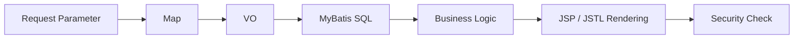

<div align="center">

  

  <h3>
    문제를 끝까지 추적하고 해결하는 개발자입니다.
  </h3>

  <p>
    보안 취약점 조치 · WAS 인프라 마이그레이션 · 엔터프라이즈 백엔드 · 실시간 AI 웹 연동
  </p>

  <a href="https://github.com/ssuukko">
    
  </a>

</div>

---

### 🔥 Highlight

| Security | Infrastructure | Field Ops | AI Web |
|:---:|:---:|:---:|:---:|
| **1,600여 건** | **WAS06 → WAS08** | **KOTSA 온사이트** | **MediaPipe + Socket.IO** |
| 웹 취약점 분석 및 조치 | 서버 복제 및 마이그레이션 | 현장 반영 및 안정화 | 실시간 면접 시뮬레이션 |

---

### 📨 Contact

[](mailto:tlstpstpdl11@gmail.com)
[](https://github.com/ssuukko)

---

### 🧑🏻‍💻 About Me

- 자동화된 툴이나 라이브러리에 맹목적으로 의존하기보다, **근본적인 원인을 분석하고 순수 코드로 문제를 해결하는 것**을 선호합니다.
- 보안 취약점, 서버 인프라, 데이터 흐름, 화면 렌더링까지 운영 환경에서 실제로 문제가 발생하는 지점을 추적합니다.
- **온사이트(On-site) 현장 배포부터 인프라 마이그레이션까지**, 시스템의 라이프사이클 전반을 책임지는 개발자를 지향합니다.
- 연차나 직급보다 **실제 엔터프라이즈 환경에서의 문제 해결 능력**으로 증명하고 싶습니다.

```text
Problem First  →  Trace Data Flow  →  Fix with Code  →  Deploy  →  Stabilize
```

---

### ⚔️ Skill

<div align="center">


</div>

---

### 🧱 Backend Architecture

- **Map + VO + MyBatis** 기반 아키텍처를 선호합니다.
- 복잡한 엔터프라이즈 비즈니스 로직에서는 단순 JPA 방식보다 데이터의 흐름과 구조를 직접 통제할 수 있는 설계가 중요하다고 봅니다.
- 요청 파라미터, 비즈니스 객체, SQL 매핑, 화면 전달 흐름을 명확히 분리해 운영 중 장애 원인을 빠르게 추적할 수 있는 구조를 지향합니다.



---

### 🛡️ Work Experience & Troubleshooting

#### 모빌리티 규제 샌드박스 시스템 보안 고도화

- Sparrow 정적 분석 툴에서 검출된 **1,600여 건**의 웹 취약점 전량 분석 및 조치
- 외부 보안 라이브러리나 Filter를 단순 도입하지 않고, **JSTL Core** 태그와 순수 코드 수정으로 XSS 방어 로직 구현
- 요청 파라미터가 JSP 화면에 렌더링되는 경로를 추적하며 실제 위험 지점 기준으로 취약점 분류 및 대응

<details>
<summary><strong>트러블슈팅 포인트 보기</strong></summary>

- 정적 분석 결과를 단순히 없애는 방식이 아니라, 실제 XSS 발생 가능 렌더링 지점을 기준으로 분류했습니다.
- 공통 Filter 도입으로 기존 화면에 생길 수 있는 사이드 이펙트를 피하고, JSP/JSTL 레벨에서 조치했습니다.
- 화면 출력 맥락에 맞게 `c:out`, 조건 처리, 값 전달 구조를 정리했습니다.

</details>

#### 서버 인프라 및 배포 관리

- 기존 **WAS06 서버 환경을 WAS08로 무중단 복제 및 마이그레이션**
- 신규 도메인 라우팅 연결 및 운영 환경 반영
- **한국교통안전공단(KOTSA, 김천) 온사이트** 방문을 통한 직접 시스템 반영 및 안정화

<details>
<summary><strong>인프라 작업 범위 보기</strong></summary>

- WAS 설정, 배포 경로, 서버 환경 차이 확인
- 신규 도메인 라우팅 연결
- 현장 반영 후 기능 확인 및 안정화

</details>

#### AI 실시간 면접 시뮬레이션 시스템

- **Next.js, MediaPipe, Socket.IO** 기반 웹 플랫폼 개발
- 브라우저 기반 실시간 안면 분석과 양방향 통신 구조 구현
- 모던 웹 프론트엔드와 AI 연동, 실시간 이벤트 처리 경험 확보

#### 알림장 프로젝트

- 기존 종이 알림장과 단체 채팅방의 정보 누락 문제를 해결하기 위한 소통 플랫폼 구축
- 학부모-교사 간 정보 전달의 **정확성**과 추적 가능성에 초점을 맞춘 구조 설계

---

### 🚀 Projects Repository

- [allimjang](https://github.com/ssuukko/allimjang) — 학부모-교사 소통 플랫폼
  - 종이 알림장과 단체 채팅방의 정보 누락 문제를 해결하기 위한 프로젝트
  - 공지 전달, 대상자 확인, 커뮤니케이션 흐름 분리

- [vocaca](https://github.com/ssuukko/vocaca) — 어휘 학습 웹앱
  - 개인 학습 흐름에 맞춘 단어 등록 및 반복 학습 서비스
  - 사용자 중심의 학습 데이터 관리 경험

---

### 📊 GitHub Activity

외부 통계 이미지 서비스는 간헐적으로 깨질 수 있어 README에서는 안정적으로 보이는 링크 중심으로 정리했습니다.

- [전체 Repository 보기](https://github.com/ssuukko?tab=repositories)
- [최근 활동 보기](https://github.com/ssuukko?tab=overview)
- [allimjang 프로젝트](https://github.com/ssuukko/allimjang)
- [vocaca 프로젝트](https://github.com/ssuukko/vocaca)
