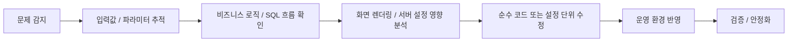

# 운영 환경에서 증명되는 문제 해결형 개발자

**Security Hardening · Enterprise Backend · WAS Migration · Real-time AI Web**

자동화된 도구에 기대기보다, 입력값이 어디서 들어와 어떻게 처리되고 어디에 출력되는지 끝까지 추적합니다.  
보안 취약점 조치, WAS 인프라 이전, 온사이트 배포, 실시간 AI 웹 구현까지 운영 환경의 문제를 직접 해결합니다.

 

 

  

 

<table>
  <tr>
    <td width="25%" align="center">
      <h2>1,600+</h2>
      <strong>웹 취약점 조치</strong> 
      Sparrow 정적 분석 결과 전량 분석
    </td>
    <td width="25%" align="center">
      <h2>WAS06 → WAS08</h2>
      <strong>운영 인프라 이전</strong> 
      서버 복제 · 마이그레이션 · 도메인 라우팅
    </td>
    <td width="25%" align="center">
      <h2>KOTSA</h2>
      <strong>온사이트 반영</strong> 
      김천 현장 배포 및 안정화
    </td>
    <td width="25%" align="center">
      <h2>AI + Realtime</h2>
      <strong>실시간 웹 구현</strong> 
      Next.js · MediaPipe · Socket.IO
    </td>
  </tr>
</table>

---

## 🧭 Recruiter Snapshot

<table>
  <tr>
    <td width="34%" valign="top">
      <h3>🛡️ 보안 취약점 처리</h3>
      

        XSS 취약점을 단순 치환으로 덮지 않고, 요청 파라미터가 JSP 화면에 렌더링되는 경로를 추적합니다.
        외부 Filter 도입 대신 <strong>JSTL Core</strong>와 순수 코드 수정으로 방어 로직을 구현했습니다.
      

    </td>
    <td width="33%" valign="top">
      <h3>🏗️ 엔터프라이즈 백엔드</h3>
      

        복잡한 업무 조건에서는 SQL과 데이터 흐름이 설명 가능해야 한다고 봅니다.
        <strong>Map + VO + MyBatis</strong> 기반으로 요청, 객체, 쿼리, 화면 전달 흐름을 명확히 분리합니다.
      

    </td>
    <td width="33%" valign="top">
      <h3>🚀 운영까지 가는 실행력</h3>
      

        코드 작성에서 멈추지 않고 WAS 이전, 신규 도메인 연결, 현장 반영, 안정화까지 확인합니다.
        로컬 성공보다 운영 환경에서의 재현성과 안정성을 기준으로 판단합니다.
      

    </td>
  </tr>
</table>

## 🧱 Problem Solving Flow

## 🛠️ Tech Dashboard

<table>
  <tr>
    <td width="20%"><strong>Backend</strong></td>
    <td>
      
      
      
      
    </td>
  </tr>
  <tr>
    <td><strong>Architecture</strong></td>
    <td>
      
      
      
    </td>
  </tr>
  <tr>
    <td><strong>Frontend</strong></td>
    <td>
      
      
      
      
    </td>
  </tr>
  <tr>
    <td><strong>AI & Realtime</strong></td>
    <td>
      
      
      
    </td>
  </tr>
  <tr>
    <td><strong>DevOps & Security</strong></td>
    <td>
      
      
      
      
    </td>
  </tr>
</table>

## 🛡️ Selected Work

<table>
  <tr>
    <td width="50%" valign="top">
      <h3>01. 모빌리티 규제 샌드박스 보안 고도화</h3>
      
<strong>문제</strong> Sparrow 정적 분석에서 대량의 웹 취약점이 검출되어 운영 시스템의 보안 기준 충족이 필요했습니다.

      
<strong>해결</strong> 화면, 요청 파라미터, 출력 위치, 렌더링 방식 기준으로 취약점을 분류하고 XSS 발생 경로를 추적했습니다.

      
<strong>성과</strong> <strong>1,600여 건</strong>의 웹 취약점을 분석 및 조치했습니다. 외부 Filter 도입 대신 <strong>JSTL Core</strong>와 순수 코드 수정으로 방어 로직을 구현했습니다.

    </td>
    <td width="50%" valign="top">
      <h3>02. 서버 인프라 및 배포 관리</h3>
      
<strong>문제</strong> 기존 WAS06 운영 환경을 WAS08로 이전해야 했고, 서비스 영향 없이 동일한 실행 환경을 재현해야 했습니다.

      
<strong>해결</strong> WAS 설정, 배포 구성, 서버 환경 차이를 확인하며 <strong>WAS06 → WAS08</strong> 복제 및 마이그레이션을 수행했습니다.

      
<strong>성과</strong> 신규 도메인 라우팅을 연결하고, <strong>한국교통안전공단(KOTSA, 김천) 온사이트</strong>에서 직접 반영 및 안정화를 진행했습니다.

    </td>
  </tr>
  <tr>
    <td width="50%" valign="top">
      <h3>03. AI 실시간 면접 시뮬레이션</h3>
      
<strong>문제</strong> 브라우저에서 면접자의 얼굴 반응을 실시간으로 분석하고, 사용자와 시스템 간 양방향 상호작용을 제공해야 했습니다.

      
<strong>해결</strong> <strong>Next.js</strong>, <strong>MediaPipe</strong>, <strong>Socket.IO</strong>를 활용해 클라이언트 기반 안면 분석과 실시간 이벤트 통신을 연결했습니다.

      
<strong>성과</strong> 모던 프론트엔드, AI 분석, 실시간 통신을 하나의 면접 시뮬레이션 경험으로 통합했습니다.

    </td>
    <td width="50%" valign="top">
      <h3>04. 알림장 프로젝트</h3>
      
<strong>문제</strong> 종이 알림장은 분실과 전달 지연이 발생하고, 단체 채팅방은 중요한 공지가 쉽게 묻히는 문제가 있었습니다.

      
<strong>해결</strong> 단순 채팅이 아니라 공지 전달, 대상자 확인, 커뮤니케이션 흐름을 분리한 소통 구조를 설계했습니다.

      
<strong>성과</strong> 학부모와 교사 사이에서 정보 전달의 <strong>정확성</strong>과 추적 가능성을 높이는 플랫폼을 구축했습니다.

    </td>
  </tr>
</table>

<strong>🔍 Troubleshooting Notes 자세히 보기</strong>

### 보안 취약점 조치

- 정적 분석 결과를 단순 문자열 치환으로 제거하지 않고, 실제 렌더링 맥락을 기준으로 위험도를 판단했습니다.
- 공통 Filter 도입 시 기존 화면에 발생할 수 있는 사이드 이펙트를 고려해 JSP/JSTL 레벨의 수정 전략을 선택했습니다.
- 입력값이 요청 파라미터, VO, Map, JSP 출력으로 이동하는 흐름을 추적하며 XSS 위험 지점을 분류했습니다.

### 인프라 이전

- WAS 설정, 실행 경로, 배포 파일, 도메인 라우팅, 반영 후 확인 절차를 함께 점검했습니다.
- 개발 환경과 운영 환경의 차이를 전제로 두고, 현장에서 즉시 확인 가능한 안정화 기준을 잡았습니다.

## 🧱 Architecture Preference

<table>
  <tr>
    <td width="28%"><strong>왜 Map + VO + MyBatis인가</strong></td>
    <td>
      엔터프라이즈 시스템에서는 업무 조건이 복잡하고 SQL이 명시적으로 관리되어야 하는 경우가 많습니다.
      이때 데이터 흐름을 직접 통제할 수 있는 <strong>Map + VO + MyBatis</strong> 구조가 장애 분석과 운영 대응에 유리하다고 판단합니다.
    </td>
  </tr>
  <tr>
    <td><strong>어떻게 설계하는가</strong></td>
    <td>
      요청 파라미터는 Map으로 유연하게 수용하고, 핵심 도메인 데이터는 VO로 명확히 표현하며,
      MyBatis XML에서는 SQL과 결과 매핑을 분리해 추적 가능한 구조를 만듭니다.
    </td>
  </tr>
  <tr>
    <td><strong>무엇을 경계하는가</strong></td>
    <td>
      프레임워크가 자동으로 처리해주는 영역을 맹신하지 않습니다.
      장애가 났을 때 어떤 입력이 어떤 SQL과 화면 출력으로 이어졌는지 설명할 수 있어야 한다고 봅니다.
    </td>
  </tr>
</table>

## 📌 Project Cards

  
  

## 📈 GitHub Overview

  

 

  
  

 

  <strong>문제를 정확히 이해하고, 운영 가능한 방식으로 해결하는 개발자가 되겠습니다.</strong>

