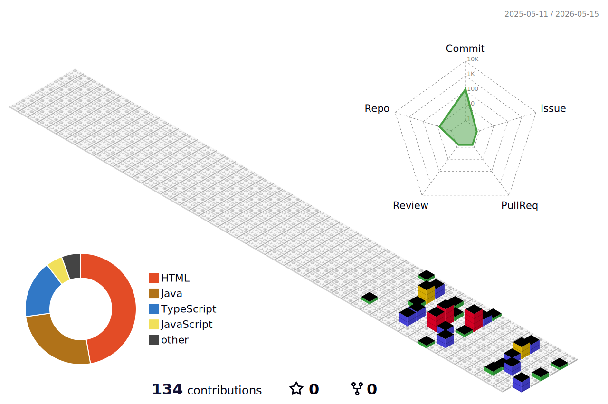

<p align="center">
  
</p>

<p align="center">
  <a href="mailto:YOUR_EMAIL@example.com">
    
  </a>
  <a href="https://github.com/YOUR_GITHUB_USERNAME">
    
  </a>
</p>

---

## 🚀 About Me

저는 연차나 직급보다 **실제 엔터프라이즈 환경에서 문제를 끝까지 해결하는 능력**을 더 중요하게 생각합니다.  
보안 취약점 분석, WAS 서버 마이그레이션, 온사이트 현장 반영, 실시간 웹/AI 연동까지 시스템이 실제로 운영되는 지점에서 필요한 일을 직접 다룹니다.

자동화된 툴이나 라이브러리에 맹목적으로 의존하기보다, **근본적인 원인을 분석하고 순수 코드로 문제를 해결하는 것**을 선호합니다.  
**온사이트(On-site) 현장 배포부터 인프라 마이그레이션까지**, 시스템의 라이프사이클 전반을 책임지는 개발자를 지향합니다.

```ts
const developer = {
  focus: 'Enterprise Troubleshooting & Secure Engineering',
  strength: ['보안 취약점 조치', '인프라 마이그레이션', '백엔드 아키텍처', '실시간 웹/AI 연동'],
  principle: '문제를 추상화하기 전에 원인을 끝까지 추적한다',
  attitude: '운영 환경에서 검증되는 코드를 만든다',
}
```

<div align="center">
  
</div>

---

## 🛠️ Tech Stack & Skills

### Backend & Architecture

<p>
  
  
  
  
  
</p>

복잡한 엔터프라이즈 비즈니스 로직을 처리할 때, 단순 JPA 방식보다 데이터의 흐름과 구조를 직접 통제할 수 있는 **Map + VO + MyBatis** 기반 아키텍처 설계를 선호합니다.  
쿼리, 파라미터, 화면 전달 객체의 흐름을 명확히 분리해 운영 환경에서 추적 가능하고 수정 가능한 구조를 만드는 데 강점이 있습니다.

### Frontend & Web

<p>
  
  
  
  
  
</p>

### AI & Real-time

<p>
  
  
  
</p>

### DevOps & Security

<p>
  
  
  
  
</p>

---

## 🛡️ Key Experiences & Projects

### 모빌리티 규제 샌드박스 시스템 보안 고도화

> 정적 분석 결과를 단순히 제거하는 수준이 아니라, 취약점의 발생 경로와 화면 렌더링 구조를 추적해 운영 가능한 방어 로직으로 개선했습니다.

| 구분 | 내용 |
|:---|:---|
| **문제** | Sparrow 정적 분석 툴에서 웹 취약점이 대량 검출되어 운영 시스템의 보안 안정성 확보가 필요했습니다. |
| **해결** | 검출된 **1,600여 건**의 취약점을 전량 분석하고, XSS 발생 가능 지점을 화면과 데이터 흐름 기준으로 분류해 조치했습니다. |
| **핵심 역량** | 외부 보안 라이브러리나 Filter를 단순 도입하지 않고, **JSTL Core** 태그와 순수 코드 수정만으로 XSS 방어 로직을 직접 구현했습니다. |
| **성과** | 보안 점검 기준에 맞는 취약점 조치를 완료하고, 기존 시스템 구조를 크게 흔들지 않으면서 안정성을 높였습니다. |

### 서버 인프라 및 배포 관리

> 서버 복제, WAS 환경 이전, 신규 도메인 라우팅까지 운영 인프라의 변경 지점을 직접 통제했습니다.

| 구분 | 내용 |
|:---|:---|
| **문제** | 기존 WAS06 환경을 WAS08로 이전해야 했고, 서비스 영향 없이 동일한 운영 환경을 재현해야 했습니다. |
| **해결** | WAS06 서버 환경을 WAS08로 **무중단 복제 및 마이그레이션**하고, 신규 도메인 라우팅 연결까지 완료했습니다. |
| **현장 경험** | **한국교통안전공단(KOTSA, 김천) 온사이트** 방문을 통해 직접 시스템 반영, 점검, 안정화를 수행했습니다. |
| **성과** | 개발 환경이 아닌 실제 기관 운영 환경에서 서버 이전과 배포 안정화를 끝까지 책임졌습니다. |

### AI 실시간 면접 시뮬레이션 시스템

> 브라우저 기반 AI 분석과 실시간 양방향 통신을 결합해 면접 상황을 시뮬레이션하는 플랫폼을 개발했습니다.

| 구분 | 내용 |
|:---|:---|
| **기술** | **Next.js**, **MediaPipe**, **Socket.IO** |
| **문제** | 면접자의 표정과 반응을 웹에서 실시간으로 분석하고, 사용자와 시스템 간 즉각적인 상호작용을 제공해야 했습니다. |
| **해결** | MediaPipe 기반 안면 분석 흐름과 Socket.IO 기반 실시간 통신 구조를 연동해 웹 환경에서 동작하는 면접 시뮬레이션을 구현했습니다. |
| **성과** | 모던 웹 프론트엔드, AI 모델 연동, 실시간 통신을 하나의 사용자 경험으로 묶어낼 수 있음을 증명했습니다. |

### 알림장 프로젝트

> 종이 알림장과 단체 채팅방의 한계를 보완해, 학부모와 교사 사이의 정보 전달 정확성을 높이는 소통 플랫폼을 구축했습니다.

| 구분 | 내용 |
|:---|:---|
| **문제** | 기존 종이 알림장은 분실과 지연이 발생하고, 단체 채팅방은 중요 공지가 쉽게 누락되는 문제가 있었습니다. |
| **해결** | 공지 전달, 대상자 확인, 커뮤니케이션 흐름을 분리해 정보가 정확히 전달되는 구조를 설계했습니다. |
| **목표** | 단순 채팅이 아니라 학부모-교사 간 정보 전달의 **정확성**과 추적 가능성을 높이는 데 집중했습니다. |

---

## 📌 Engineering Principles

```text
문제를 먼저 분해하고, 기술은 그 다음에 선택합니다.
운영 환경에서 설명 가능한 코드를 좋은 코드라고 생각합니다.
라이브러리 도입보다 원인 분석과 구조 이해를 우선합니다.
보안, 인프라, 사용자 경험은 분리된 영역이 아니라 하나의 시스템 품질입니다.
```

---

## 📈 GitHub Stats

<p align="center">
  
  
</p>

---

## 📬 Contact

<p align="center">
  <a href="mailto:YOUR_EMAIL@example.com">
    
  </a>
  <a href="https://github.com/YOUR_GITHUB_USERNAME">
    
  </a>
  <a href="https://YOUR_BLOG_URL">
    
  </a>
</p>


